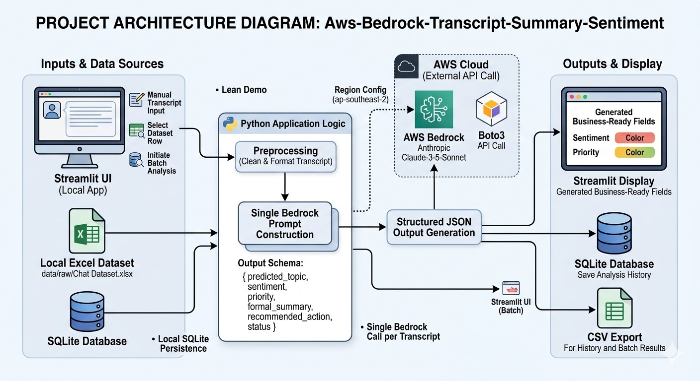
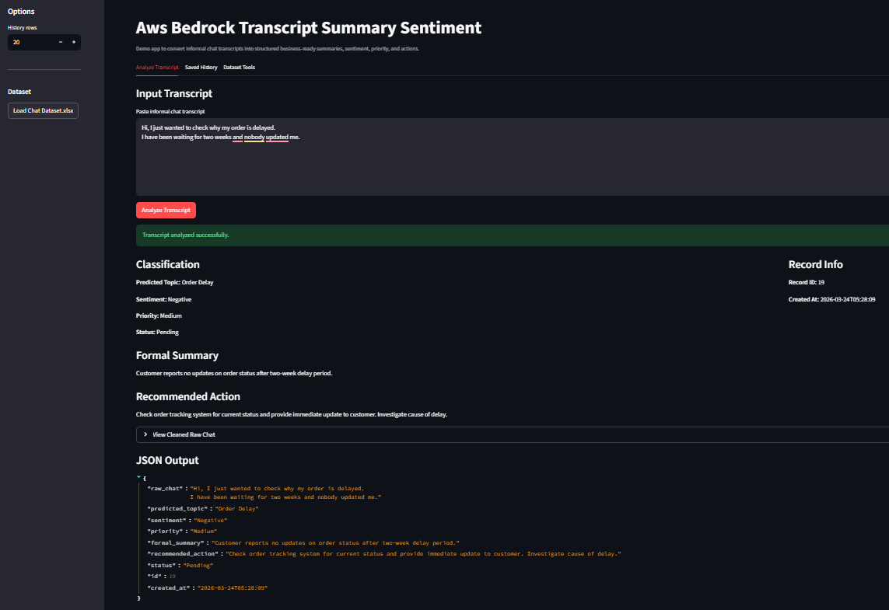
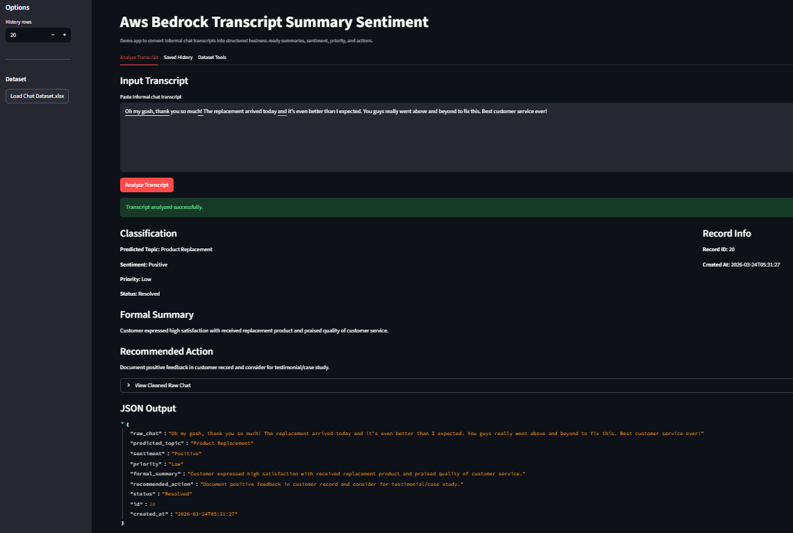
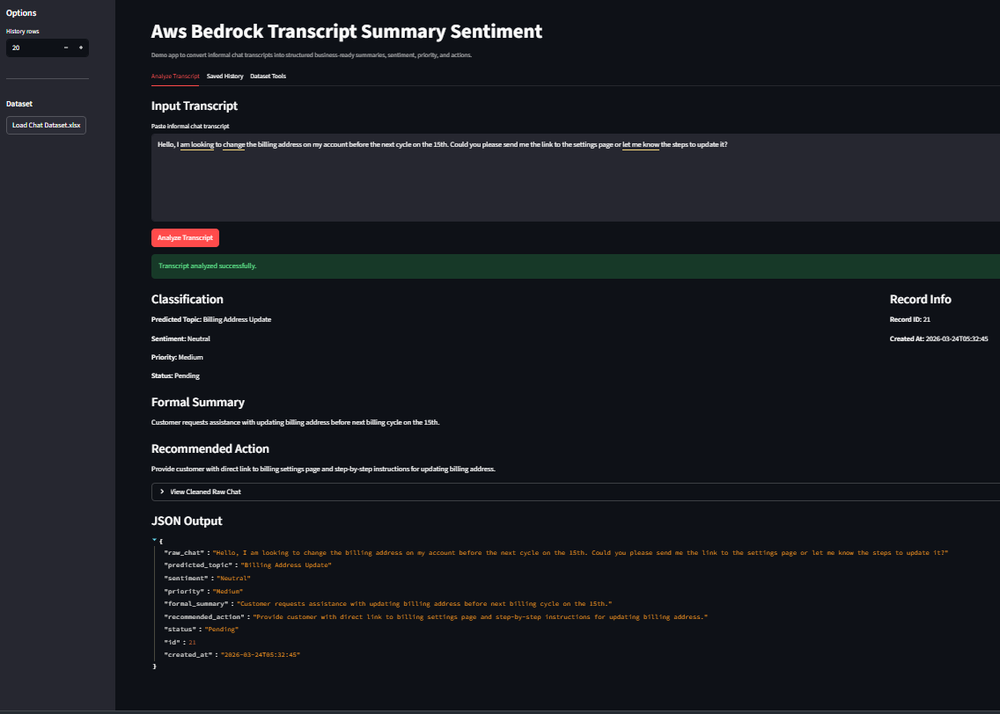
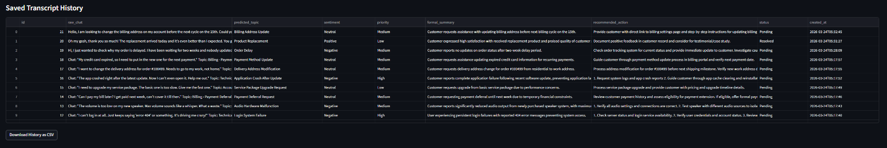
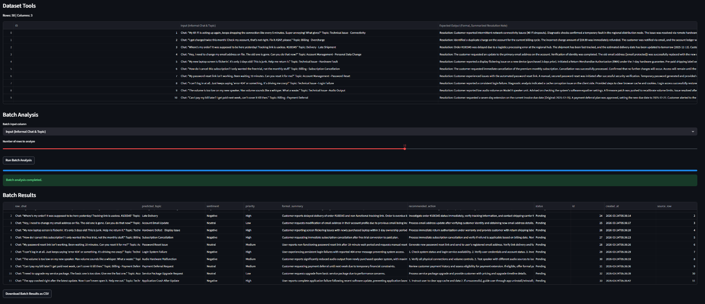
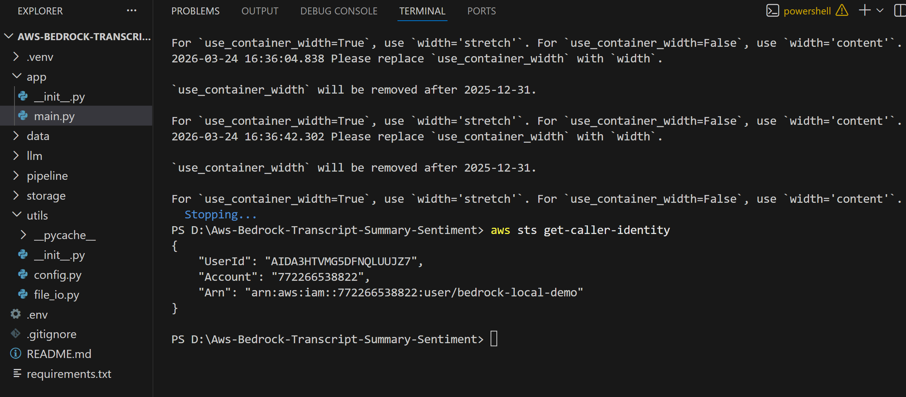

# Aws-Bedrock-Transcript-Summary-Sentiment

A lean AWS Bedrock demo that converts informal support-style chat transcripts into structured, business-ready resolution notes with a single model call.

---

## Project Architecture



This project is intentionally simple and demo-focused. Instead of using RAG, vector databases, or multi-agent workflows, it follows a clean single-pass pipeline:

1. A user enters an informal transcript manually or selects a row from an Excel dataset.
2. The transcript is lightly preprocessed to normalize whitespace and clean the input.
3. A single AWS Bedrock prompt is sent to an Anthropic model.
4. The model returns a structured JSON response with topic, sentiment, priority, formal summary, recommended action, and status.
5. The result is shown in a Streamlit interface and saved to SQLite for history and export.

This makes the demo easy to explain, cost-conscious, and practical for showcasing structured LLM outputs in a support or service-desk style workflow.

---

## Overview

The goal of this project is to demonstrate how informal, messy customer or support conversations can be transformed into a standardized internal record that feels ready for business operations.

The app is built for a lightweight demo scenario, so the design decisions were deliberately kept minimal:

- one Bedrock call per transcript
- no RAG
- no FAISS or vector database
- no multi-agent orchestration
- local SQLite storage for quick persistence
- Streamlit for a fast interactive UI

The result is a small but complete demo application that supports:

- single transcript analysis
- saved history viewing
- Excel dataset loading
- batch analysis on dataset rows
- CSV export for results

---

## What the App Produces

For each transcript, the model returns a structured record with the following fields:

```json
{
  "raw_chat": "string",
  "predicted_topic": "string",
  "sentiment": "Positive | Neutral | Negative",
  "priority": "Low | Medium | High",
  "formal_summary": "string",
  "recommended_action": "string",
  "status": "Resolved | Pending | Escalated"
}
```

This makes the output easy to use in downstream workflows such as support dashboards, quality review, escalation triage, or internal service-note generation.

---

## Application Flow

```text
User Transcript / Dataset Row
        ↓
Preprocessing
        ↓
Single Bedrock Prompt
        ↓
Structured JSON Response
        ↓
Streamlit Display
        ↓
SQLite Storage
        ↓
History / Batch Results / CSV Export
```

---

## Demo Screens

### Single Transcript Analysis

This view shows manual input analysis where an informal transcript is converted into a structured support-style record.



A second example shows the same workflow with the structured fields and JSON output clearly visible.



A third example captures the interface after a successful run, including record details and the final Bedrock-generated output.



### Saved History

All processed records are stored in SQLite and displayed in a history tab for quick review.



### Batch Analysis from Excel Dataset

The app can load an Excel dataset, preview rows, run multiple analyses in sequence, and export results as CSV.



### AWS Authentication and Local Project Setup

This project uses AWS CLI-configured credentials for local Bedrock access. The screenshot below also shows the local project folder structure used for development.



---

## Dataset

The project uses an Excel dataset named:

```text
data/raw/Chat Dataset.xlsx
```

The dataset structure used in this demo contains columns such as:

- `ID`
- `Input (Informal Chat & Topic)`
- `Expected Output (Formal, Summarized Resolution Note)`

This allows the app to be used both interactively and as a mini evaluation/demo tool using prepared examples.

---

## Features

- Analyze one transcript at a time with a single Bedrock call
- Generate structured business-ready JSON output
- Classify topic, sentiment, priority, and status
- Produce a concise formal summary
- Suggest a practical recommended action
- Store records locally in SQLite
- Load and preview Excel dataset rows
- Run batch analysis on multiple rows
- Export history and batch results as CSV

---

## Tech Stack

- **Python**
- **AWS Bedrock**
- **Anthropic Claude on Bedrock**
- **Boto3**
- **Streamlit**
- **Pandas**
- **OpenPyXL**
- **SQLite**
- **python-dotenv**

---

## Project Structure

```text
Aws-Bedrock-Transcript-Summary-Sentiment/
├── app/
│   ├── __init__.py
│   └── main.py
├── data/
│   ├── raw/
│   │   └── Chat Dataset.xlsx
│   ├── processed/
│   └── db/
│       └── transcript_analysis.db
├── images/
│   ├── architecture.png
│   ├── analyse_transcript_1.png
│   ├── analyse_transcript_2.png
│   ├── analyse_transcript_3.png
│   ├── saved_history.png
│   ├── batch-analysis.png
│   └── aws-authentication-and-folder-view.png
├── llm/
│   ├── __init__.py
│   ├── prompts.py
│   └── analyzer.py
├── pipeline/
│   ├── __init__.py
│   ├── preprocess.py
│   └── run_pipeline.py
├── storage/
│   ├── __init__.py
│   └── sqlite_store.py
├── utils/
│   ├── __init__.py
│   ├── config.py
│   └── file_io.py
├── .env
├── .gitignore
├── README.md
└── requirements.txt
```

---

## Setup

### 1. Create a virtual environment

```bash
python -m venv .venv
```

### 2. Activate the environment

PowerShell:

```powershell
Set-ExecutionPolicy -Scope Process -ExecutionPolicy Bypass
.venv\Scripts\Activate.ps1
```

Alternative:

```powershell
.venv\Scripts\activate.bat
```

### 3. Install dependencies

```bash
pip install -r requirements.txt
```

### 4. Configure environment variables

Create a `.env` file in the project root:

```env
AWS_REGION=ap-southeast-2
BEDROCK_MODEL_ID=apac.anthropic.claude-3-5-sonnet-20241022-v2:0
```

### 5. Configure AWS credentials

Install the AWS CLI and configure credentials:

```bash
aws configure
```

Then verify:

```bash
aws sts get-caller-identity
```

---

## Running the App

```bash
streamlit run app/main.py
```

---

## Why This Design

This project was built as a demo, so simplicity was more important than architectural complexity.

A larger production system might include:

- retrieval-augmented generation
- vector search
- prompt/version tracking
- evaluation metrics
- retry and observability layers
- role-based access and remote deployment

For this demo, a single Bedrock call provides enough value while keeping the app easy to understand and present.

---

## Example Use Cases

- customer support note generation
- complaint triage
- escalation tagging
- service-desk summarization
- internal QA demos for structured LLM outputs
- business-ready resolution note generation from informal transcripts

---

## Future Improvements

- side-by-side comparison with expected dataset output
- prompt versioning
- batch evaluation scoring
- Excel export
- dashboard metrics
- better error handling and retry logic
- deployment to a shared internal environment

---

## Author

Built as a practical AWS Bedrock transcript analysis demo for summarization, sentiment classification, prioritization, and action extraction.
